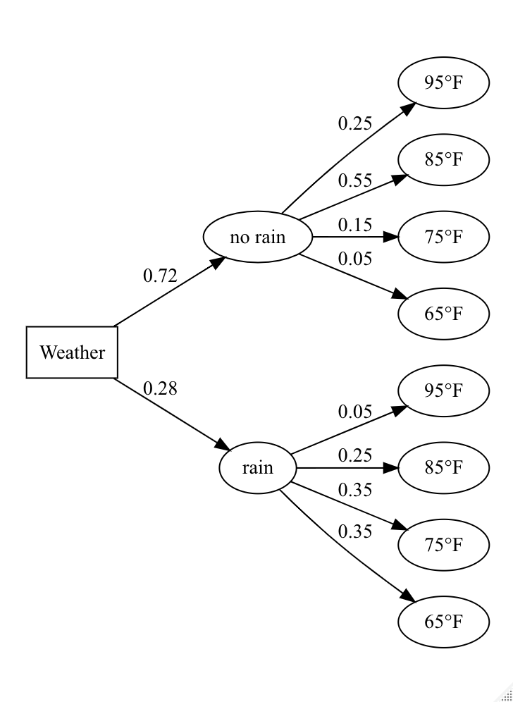

# r-tree-diagram

## Description

A function to create **tree diagram visualizations** for conditional probabilities in R. 

## Input data

The only required input to the function is a dataframe with the following structure. The `pathString` column 
should have the names of the potential outcomes at each tree level. For example, there will be *no rain* or there will be *rain* as our first-level outcome. 
The column also includes second-level outcomes (e.g., no rain and a 65 degree day) separated by a forward-slash `/`. The `prob` column contains the probabilities associated with 
each path. Although there is no limit to the number of conditional paths that might be included, at a certain stage the visualization will become challenging to read. See `probabilities.csv` example file in this repo.

| pathString | prob |
|----------|:-------------:|
| no rain | 0.72 |
| no rain/95°F | 0.25 |
| no rain/85°F | 0.55 |
| no rain/75°F | 0.15 |
| no rain/65°F |0.05 |
| rain | 0.28 |
| rain/95°F | 0.05 |
| rain/85°F | 0.25 |
| rain/75°F | 0.35 |
| rain/65°F | 0.35 |

## Usage

`make_my_tree(mydf = prob_data, branch_levels = NULL, show_rank = TRUE, direction = "LR",  root_name = "Start", font_name = 'helvetica')`

## Arguments

| Argument   |      Description      |  
|----------|:-------------:|
| mydf | dataframe with the probability data as described above |
| branch_levels | the number of branch levels to show       |  
| show_rank | logical. should ranks be shown in final branch |  
| direction | the direction of the tree. One of "LR" (left-to-right), "RL" (right-to-left), "TB" (top-to-bottom), or "BT" (bottom-to-top)  |  
| root_name | character. the name label for the starting node |  
| font_name | character. font type such as 'helvetica' (default) or 'times' |  

## Required libraries
* `library(tidyverse)`
* `library(data.tree)`

## Examples

1. Default output that shows everything

`make_my_tree(prob_data)`

2. Remove the rank display variable

`make_my_tree(prob_data, show_rank = FALSE)` 

3. Hide the cumulative probabilities by reduces the number of branch levels shown

`make_my_tree(prob_data, branch_levels = 2,  show_rank = FALSE)` 

4. Change start node name and font type

`make_my_tree(mydf = prob_data, branch_levels = 2, show_rank = False, direction = "LR", root_name = "Weather", font_name = "times")` 

## Inspiration

* [Introduction to data.tree by Christoph Glur](https://cran.r-project.org/web/packages/data.tree/vignettes/data.tree.html)
* [data.tree sample applications by Christoph Glur](https://cran.r-project.org/web/packages/data.tree/vignettes/applications.html)
* [Node Shapes on www.graphviz.org](https://www.graphviz.org/doc/info/shapes.html)
